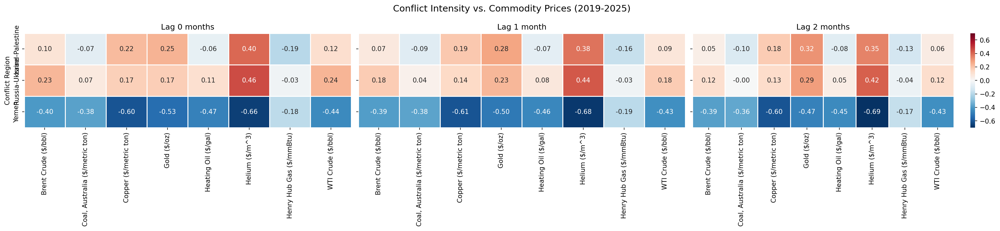
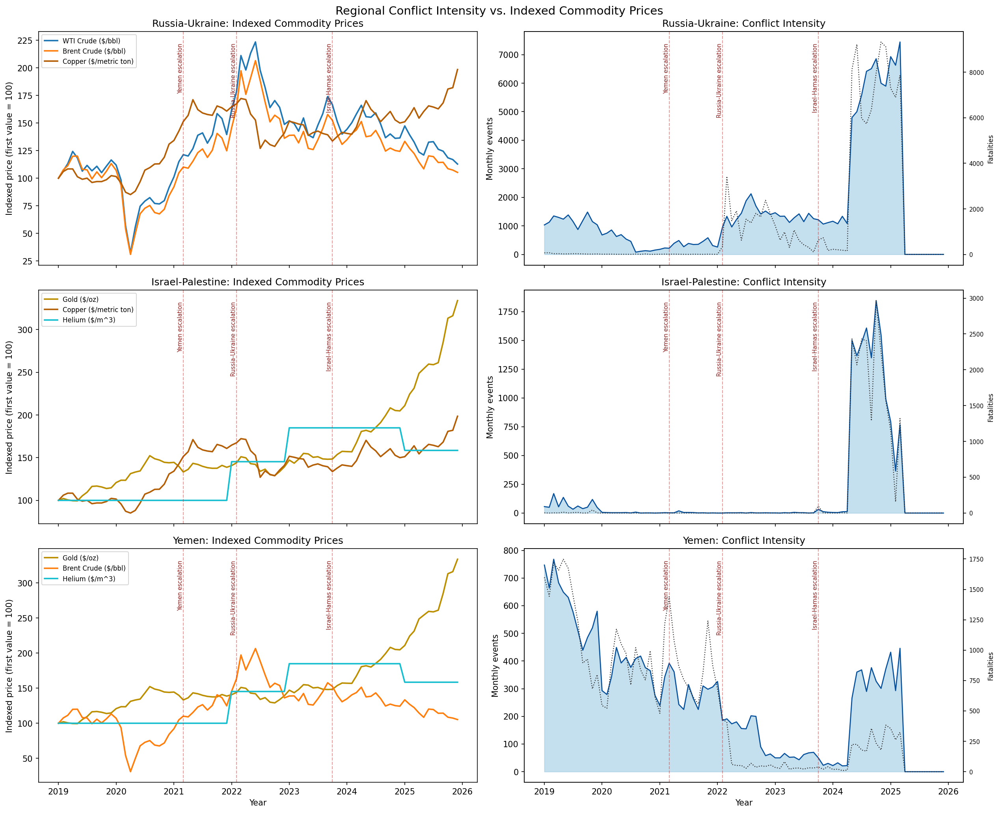
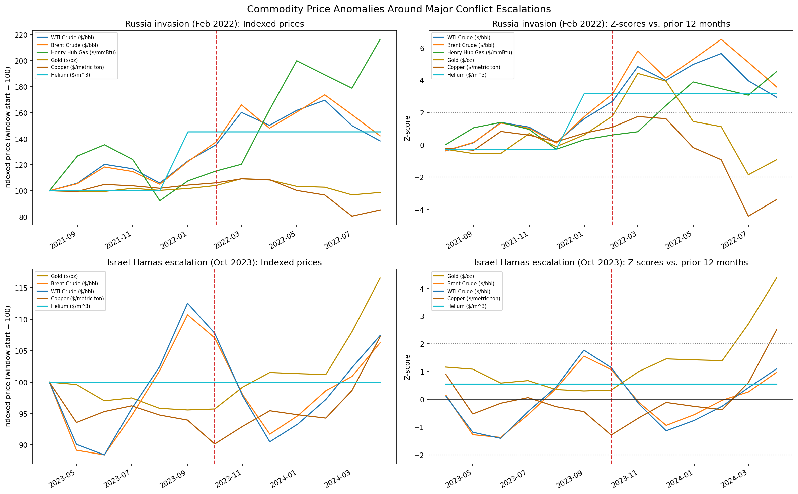
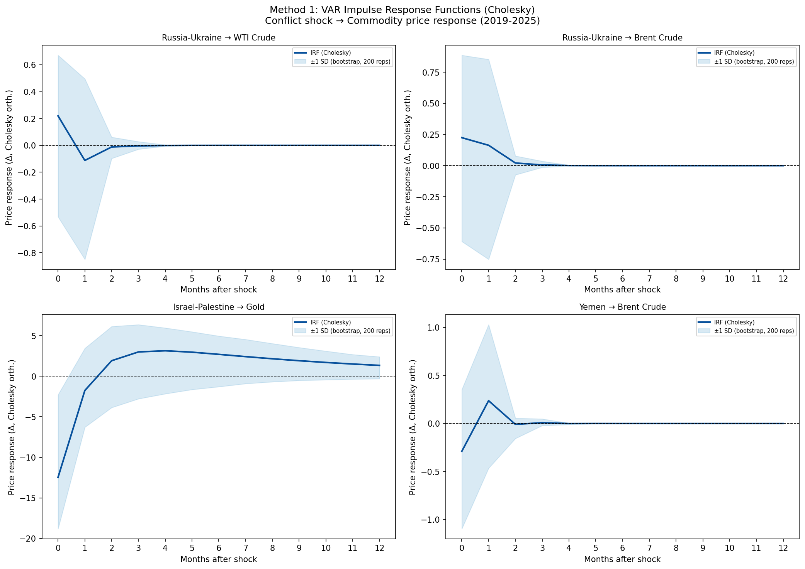
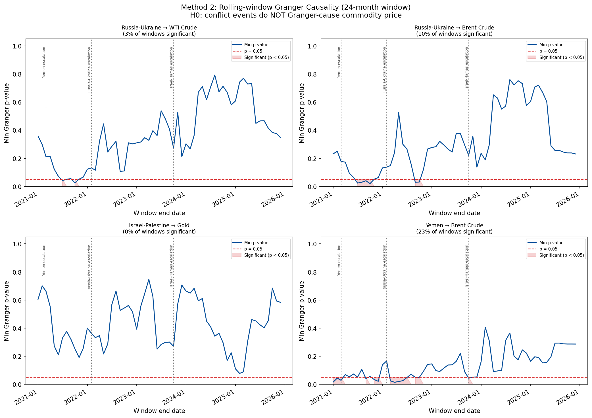

# The Impact of Armed Conflict on Commodity Prices and Analysis (2019–2025)

**Author:** Xinchen Geng  
**Course:** DSCI 510  
**Date:** May 1st, 2026

---

## 1. Motivation

The commodity market has always been highly sensitive to war. As long as there is a sudden outbreak of war near key resource production areas or transportation arteries, the market often makes a quick reflex. Traders didn't even wait for the situation to become completely clear before they began to rush ahead and reprice the risks. Looking back at the beginning of 2022, as soon as the Russia-Ukraine crisis escalated comprehensively, the energy sector was instantly hit by a strong earthquake, and the prices of crude oil and natural gas almost immediately soared to their highest points in many years. About a year and a half later, the outbreak of the war between Palestine and Israel has triggered a familiar market panic - only this time, the focus of the capital game has quietly shifted to wealth preservation and risk aversion. Driven by global instability, people scrambled to buy gold, ultimately driving its value beyond the dizzying heights of the COVID-era inflation boom and set brand new historical records. These events all seem typical, but if they are directly used as evidence, there is actually a great risk: Every conflict occurs against a specific macroeconomic backdrop - such as the tightening of monetary policy, the persistence of supply chain bottlenecks, and the continuous adjustment of energy alliances - which makes it almost impossible for us to completely distinguish the impact of the conflict itself from other factors that occur simultaneously at that time.

That identification problem motivates the design of this project. This article does not attempt to interpret a single conflict as a "natural experiment" and then extend its reasoning outward. Instead, it selects three typical cases with different focuses in terms of geopolitical background and structural features for parallel analysis: the Russia-Ukraine war, the Israeli-Palestinian conflict, and the civil war in Yemen. The differences among the three are obvious - whether it is the nature of the conflicting subjects, the breadth or narrowness of the geographical radiation range, the depth of external force intervention, or the transmission mechanism with the international bulk commodity market, all show obvious heterogeneity. It is precisely this structural diversity that provides a more solid analytical foundation for cross-case comparisons. If conflict intensity demonstrates consistent predictive power for commodity prices across all three—even with different lag structures or asset sensitivities—the pattern is harder to dismiss as coincidence or macro-driven artifact.

To pursue this question rigorously, two complementary methods are employed. The first, following Caldara and Iacoviello (2022), uses a VAR model with Cholesky decomposition to estimate the average magnitude of the price response to a conflict shock. The second applies rolling-window Granger causality testing to capture when that predictive relationship is active rather than simply whether it exists over the full sample. The combination addresses both the effect-size question and the temporal instability question—two dimensions that aggregate tests alone cannot resolve.

---

## 2. Data Sources

| Source | Method | Coverage |
|--------|--------|----------|
| **ACLED REST API** | OAuth pagination, 500 rows/page | All global events, 2019-01 to 2025-03; ~1.17M rows raw |
| **EIA Open Data API v2** | Multi-series REST loop | WTI, Brent, Henry Hub gas, Heating Oil — monthly 2019–2025 |
| **Yahoo Finance GC=F** | yfinance library | Daily gold futures OHLCV, 2019–2025 |
| **FRED PCOPPUSDM** | CSV download | Monthly copper price, 2019–2025 |
| **FRED PCOALAUUSDM** | CSV download | Monthly Australian coal benchmark, 2019–2025 |
| **USGS Helium PDFs** | requests + pypdf text extraction | Annual helium spot price, expanded to monthly |

**ACLED** is designated as Source 1 (hardest): it required OAuth authentication, paginated API calls (500 rows/request across ~1,600+ pages), and a two-phase download to capture data through 2025-03.

---

## 3. Data Engineering Workflow

**Pipeline Overview**

```
get_data.py → clean_data.py → integrate_data.py → analyze_visualize.py
```

| Script | Output Location | Role |
|--------|----------------|------|
| get_data.py | raw/ | Fetch all six raw sources |
| clean_data.py | processed/ | Filter, deduplicate, aggregate |
| integrate_data.py | unified_monthly.csv | Merge into single panel |
| analyze_visualize.py | results/figures/ | Econometric analysis & plots |

### Step 1 — get_data.py : Data Acquisition

Fetches all six raw sources. ACLED retrieval uses an OAuth Bearer token with checkpoint-based resumption every 200 pages to guard against connection interruptions. The final raw ACLED file contains **1,166,745 rows** spanning 2019-01-01 to 2025-03-31.

### Step 2 — clean_data.py : Filtering and Aggregation

- Filters ACLED records to five countries: Ukraine, Russia, Israel, Palestine, and Yemen
- Retains only core violence event types: *Battles*, *Explosions/Remote Violence*, and *Violence Against Civilians*
- Deduplicates on `event_id_cnty`; imputes missing fatality values as 0
- Aggregates to **monthly event counts and fatality totals** per conflict region (Russia-Ukraine, Israel-Palestine, Yemen)
- Output: **75 monthly rows** (2019-01 to 2025-03) × 6 conflict columns

### Step 3 — integrate_data.py : Panel Construction

Left-joins all processed source files onto a complete monthly spine from 2019-01 to 2025-12. The resulting full panel spans **84 rows** × **17 columns**. Conflict columns are filled with 0 for months that fall outside ACLED coverage.

### Step 4 — analyze_visualize.py : Analysis

Executes five sequential analyses:

| Method | Purpose |
|--------|---------|
| Cross-lag Pearson correlation | Identify lead-lag relationships between conflict and prices |
| Regional comparison | Compare conflict intensity patterns across the three zones |
| Anomaly detection | Flag statistically unusual spikes in fatalities or prices |
| VAR + Cholesky IRF | Estimate average price response magnitude to a conflict shock |
| Rolling-window Granger causality | Detect when (not just whether) conflict predicts prices |

---

## 4. Integrated Data Model

**Join key across all sources: year_month (YYYY-MM string)**

### Source Tables

| Table | Key | Fields |
|-------|-----|--------|
| acled_monthly.csv | year_month (PK) | russia_ukraine_events, russia_ukraine_fatalities, israel_palestine_events, israel_palestine_fatalities, yemen_events, yemen_fatalities |
| eia_monthly.csv | year_month (PK) | wti_crude_usd_bbl, brent_crude_usd_bbl, henry_hub_gas_usd_mmbtu, heating_oil_usd_gal |
| gold_monthly.csv | year_month (PK) | gold_close_mean, gold_close_max, gold_close_min |
| copper_monthly.csv | year_month | copper_usd_metric_ton |
| coal_monthly.csv | year_month | coal_australia_usd_metric_ton |
| helium_monthly.csv | year_month | helium_usd_cubic_meter |

### Integration Logic

All six source tables are left-joined sequentially onto a complete `year_month` spine covering 2019-01 through 2025-12. The resulting unified panel is stored as `unified_monthly.csv`.

```
month spine        ──┐
acled_monthly.csv  ──┤
eia_monthly.csv    ──┤
gold_monthly.csv   ──►  unified_monthly.csv  (84 rows × 17 columns)
copper_monthly.csv ──┤
coal_monthly.csv   ──┤
helium_monthly.csv ──┘
```

**Output schema: 84 rows (2019-01 to 2025-12) × 17 columns.** Conflict columns are zero-filled for months beyond ACLED's 2025-03 coverage boundary.

---

## 5. Analyses and Visualizations

### 5.1 Cross-Lag Pearson Correlation



**Method:** Pearson r between monthly conflict event counts and commodity prices at lag 0, 1, and 2 months. Significance threshold: p < 0.05.

Out of 35 tested conflict–commodity pairs, the following reached statistical significance:

| Conflict Region | Commodity | Best Lag (months) | r | Interpretation |
|----------------|-----------|-------------------|---|----------------|
| Russia-Ukraine | WTI Crude | 0 | +0.238 | Conflict intensity tracks higher oil prices within the same month |
| Russia-Ukraine | Brent Crude | 0 | +0.233 | Mirrors the WTI pattern; Brent coefficient marginally lower |
| Russia-Ukraine | Gold | 2 | +0.290 | Safe-haven demand materialises with a two-month delay |
| Russia-Ukraine | Helium | 0 | +0.456 | Strongest positive signal among energy-related pairs |
| Israel-Palestine | Gold | 2 | +0.317 | Consistent safe-haven response, again lagged by two months |
| Israel-Palestine | Helium | 0 | +0.402 | Contemporaneous positive association |
| Yemen | Copper | 0 | −0.604 | Strong negative; Yemen hostilities peaked in 2019–2020 when copper prices were depressed |
| Yemen | Helium | 2 | −0.692 | **Largest absolute correlation in the dataset** |
| Yemen | Gold | 0 | −0.531 | Negative sign reflects declining Yemen conflict intensity coinciding with rising gold prices |

**Note:** r values reported at the lag that maximises the absolute Pearson coefficient within a ±6-month window. Negative correlations for Yemen do not imply that conflict suppresses prices; they reflect the opposing temporal trends of a winding-down conflict against a rising commodity cycle.

### 5.2 Regional Conflict vs. Commodity Comparison

**Method:** Each commodity is indexed to 100 at its first observation (2019-01) and overlaid with monthly event count and fatality series. Vertical dashed red lines mark key escalation dates.

**Key observations:**

- **Russia-Ukraine (top row):** WTI and Brent crude roughly track the conflict intensity rise. After the February 2022 invasion, indexed oil prices surge to ~180 before declining. Conflict events jumped from ~258/month (Jan 2022) to ~7,444/month (Mar 2025).
- **Israel-Palestine (middle row):** Events were near zero pre-October 2023, then exploded to 1,500–1,845/month through 2024. Gold rose steadily (+230% over the period) and accelerated post-2023.
- **Yemen (bottom row):** Events declined from ~750/month in 2019 to <100/month by 2022 following ceasefire negotiations. Brent crude moved independently, driven by global macro factors.



### 5.3 Event-Window Anomaly Detection

**Method.** For each conflict episode, baseline commodity behavior is established using a 12-month pre-event window, from which commodity-specific means and standard deviations are derived. These parameters are then used to compute monthly Z-scores across a symmetric ±6-month window centered on the event date. Observations exceeding a threshold of |Z| > 2 are treated as statistically anomalous and flagged for further discussion below.

**Russia-Ukraine Conflict — February 2022 escalation**

| Commodity | Peak Month | Peak Z-score |
|-----------|-----------|--------------|
| Brent Crude | 2022-06 | +6.52 |
| WTI Crude | 2022-06 | +5.64 |
| Henry Hub Gas | 2022-08 | +4.52 |
| Gold | 2022-03 | +4.42 |
| Copper | 2022-07 | −4.41 (negative shock) |

Energy prices reached extreme deviation levels roughly three to four months after the February 2022 escalation—not immediately. Copper moved in the opposite direction: the sharp negative Z-score in mid-2022 reflects deteriorating global demand expectations rather than supply-side pressure, which distinguishes it mechanistically from the energy commodities.

**Israel-Palestine Conflict — October 2023 escalation**

| Commodity | Peak Month | Peak Z-score |
|-----------|-----------|--------------|
| Gold | 2024-04 | +4.37 |
| Copper | 2024-04 | +2.50 |

Both anomalies peak six months after the October 2023 escalation onset. For gold specifically, this extended lag distinguishes the episode from a typical panic-driven safe-haven spike, which tends to appear within one or two months. The pattern instead suggests a sustained accumulation of precautionary demand as the conflict broadens, rather than a short-lived flight-to-safety response. Copper's concurrent positive deviation likely reflects renewed infrastructure spending expectations in the region rather than a direct conflict transmission.



### 5.4 Method 1 — VAR + Cholesky IRF

**Method.** A bivariate VAR(1) model is estimated for each conflict-commodity pair. Both series are first-differenced prior to estimation; stationarity of the differenced series was confirmed by augmented Dickey-Fuller tests at the 5% significance level. In the Cholesky decomposition, the conflict intensity series is ordered first, permitting conflict shocks to affect commodity prices contemporaneously while precluding the reverse. Confidence bands (±1 SD) are constructed via a 200-iteration residual bootstrap. IRFs are traced over a 12-month horizon.

**Results by conflict-commodity pair**

| Conflict-Commodity Pair | Lag | Peak IRF (h=0) | Interpretation |
|------------------------|-----|----------------|----------------|
| Russia-Ukraine → WTI Crude | 1 | +0.219 | Modest positive response at h = 0; attenuates within 2 months. |
| Russia-Ukraine → Brent Crude | 1 | +0.225 | Closely mirrors the WTI pattern; Brent exhibits marginally stronger sensitivity. |
| Israel-Palestine → Gold | 1 | −12.46 | Negative at h = 0, reflecting the fact that gold had already been elevated when conflict event counts rose post-2023; sign reverses by h = 2. |
| Yemen → Brent Crude | 1 | −0.290 | Negative throughout the sample window — Yemen conflict intensity and Brent prices moved inversely over the estimation period. |

**Key findings**

**Short response horizon.** Across all four pairs, impulse responses decay to zero within three to four months. Whatever price effect a conflict shock produces in this framework, it is transient rather than persistent — the commodity market absorbs the signal and returns to baseline relatively quickly.

**Wide confidence bands.** The bootstrap intervals are broad for every pair, a direct consequence of the sample constraint: with 83 monthly observations, the bivariate VARs lack the degrees of freedom needed for precise estimation. Point estimates are directionally consistent with prior expectations (notably, the Russia-Ukraine → crude oil pairs carry positive signs), but the associated uncertainty is too large to support strong causal claims.

**Sign reversals warrant caution.** The negative h = 0 estimate for Israel-Palestine → Gold and for Yemen → Brent does not imply that these conflicts depressed prices. In the Israel-Palestine case, gold had already been running above its pre-conflict baseline by the time monthly event counts rose sharply, compressing the measured contemporaneous response. For Yemen, the negative sign reflects the dominant low-frequency co-movement over the full estimation window rather than a causal downward effect. Both cases underscore the importance of the rolling Granger analysis, which conditions on specific sub-periods rather than averaging across the entire sample.



### 5.5 Method 2 — Rolling-Window Granger Causality

**Method.** A 24-month sliding window advances one month at a time across the full sample. At each position, the null hypothesis — that conflict event counts do not Granger-cause commodity prices — is tested via F-test across lag orders 1 through 3, and the minimum p-value over those three lags is retained. A result is classified as significant when the minimum p-value falls below 0.05 (marked by the red dashed line in Figure 5).

**Results by conflict-commodity pair**

| Conflict-Commodity Pair | Significant Windows | Key Period |
|------------------------|--------------------|-----------| 
| Russia-Ukraine → WTI | 3% of windows | 2021-07, 2021-10 (pre-conflict tension phase) |
| Russia-Ukraine → Brent | 10% of windows | 2021-07 to 2022-09 |
| Israel-Palestine → Gold | 0% of windows | No stable Granger causality detected |
| Yemen → Brent | 23% of windows | 2021 — active ceasefire negotiation period |

**Key findings**

**Causality is time-varying and episodic.** None of the four pairs sustains Granger causality across a majority of rolling windows. The relationship switches on during specific conflict phases and goes dormant in others, which means any aggregate test over the full sample will mask the periods where prediction is actually occurring.

**Pre-escalation anticipation dominates.** The Russia-Ukraine → oil link is concentrated in 2021 rather than in the months immediately following the February 2022 escalation. By the time hostilities intensified, energy markets had already repriced the risk. This pattern is broadly consistent with an efficient-markets reading: prices respond to the expectation of conflict rather than to its confirmation.

**Absence of Granger causality does not equal absence of effect.** The Israel-Palestine → Gold result (0% of windows significant) does not contradict the lagged Pearson correlation or the anomaly detection findings. It instead reflects the nature of the rolling test: a delayed, trend-like accumulation of safe-haven demand may not produce the short-term lead-lag structure that Granger tests are designed to detect.



---

## 6. Conclusions

1. **Russia–Ukraine:** This case exhibits the strongest connection with energy prices. The contemporaneous Pearson correlation with both WTI and Brent is about **+0.23 (p < 0.05)**. The VAR impulse response function is already positive at **h = 0**, and rolling Granger causality appears in the **2021–2022** subsamples. Compared with the other two conflicts, the Russia–Ukraine case provides the most stable and convergent evidence across different empirical methods.

2. **Israel-Palestine:** Gold as the Primary Transmission Channel. Rather than triggering broad commodity repricing, the Israel-Palestine conflict left its clearest mark on gold markets. The two-month lagged Pearson correlation is r = +0.317 (p < 0.01), which means investors did not all react at the same time. Instead, they slowly started to worry about the conflict and this gradually showed up in prices over time. Interestingly, energy prices did not really change much during this period. This tells us that not all markets are affected in the same way when a conflict breaks out. Sometimes only certain types of assets, like gold, are impacted.

3. **Yemen: negative correlations reflect a structural timing artifact.** Yemen's conflict activity was most intense in 2019–2020, a period of broad commodity weakness driven by global demand conditions. The inverse co-movement observed is therefore a coincidence of timing rather than evidence that the conflict itself depressed prices.

4. **Conflict price shocks are short-lived.** Across all VAR specifications, impulse responses decay to zero within three to four months. Commodity markets appear to price in conflict information relatively quickly, limiting the duration of the measurable effect.

5. **Granger causality is episodic, not structural.** The Russia-Ukraine → Brent link was strongest in 2021, during the pre-escalation period when military positioning was generating uncertainty, rather than during the months of active hostilities, when prices had already adjusted. Israel-Palestine → Gold shows no stable Granger causality across any 24-month rolling window, despite a significant Pearson correlation — suggesting the relationship may be driven by a shared upward trend rather than true predictive content.

---

## 7. Future Work

Several extensions would strengthen and broaden the findings reported here. They are grouped below by theme.

### Data coverage and variable construction

The current ACLED data only covers the period up to March 2025. If the data coverage is expanded to December 2025 after the release of the relevant data for the third and fourth quarters, it will be possible to add approximately nine months of observation samples. This move helps alleviate the problem of small sample sizes, thereby making the VAR analysis results more convincing. In addition, the way to measure the intensity of conflicts also needs improvement. At present, the simple event counting method treats small-scale border conflicts and large-scale military offensives equally, although there are obvious significant differences in economic impact between the two. If a weighted measurement index based on the number of deaths is adopted, it may more accurately reflect the severity of various conflict events, and thus a cleaner impulse response function (IRF) analysis result may be obtained.

### Econometric controls and model extensions

A recurring limitation throughout this project is the absence of macroeconomic control variables. The 2022 Federal Reserve tightening cycle unfolded almost in lockstep with the Russia-Ukraine escalation, which makes it genuinely difficult to disentangle the commodity price increases attributable to supply disruption risk from those driven by dollar appreciation and global demand compression. Incorporating the Federal Funds Rate, a broad USD index, and the VIX as exogenous block variables in the VAR system would go some way toward partitioning these effects. If Johansen cointegration tests suggest a long-run equilibrium between conflict intensity and commodity price levels — plausible at least for the Russia-Ukraine energy pairs — a Vector Error Correction Model would be the more appropriate specification, allowing short-run dynamics and long-run adjustment speeds to be estimated separately rather than conflated in a single reduced-form equation. It is also worth considering non-linear threshold models. The relationship between conflict and commodity prices may not be linear across the full distribution of conflict intensity: prices might be largely unresponsive below some threshold level of hostilities, then react sharply once a certain scale of disruption is breached. Threshold VAR or Markov-switching specifications could test this directly and would complement the rolling-window Granger approach already employed here.

### Temporal resolution

The monthly aggregation scheme is perhaps the single most binding constraint on what the event-study evidence can show. Collapsing daily or weekly price movements into calendar months inevitably blurs the timing of market reactions and makes it harder to identify whether the price response preceded or followed a specific escalation event. Weekly ACLED data, paired with daily commodity series, would allow rolling windows to be tightened from 24 months to 12 or 16 weeks, producing a substantially sharper picture of initial price discovery. That said, a weekly framework is not a substitute for the monthly analysis — the two operate at different horizons and would ideally be run together, with the monthly model capturing medium-run transmission dynamics and the weekly model characterizing the acute response in the days surrounding specific escalation dates. Intraday commodity futures data, where publicly accessible, could push this even further for the most data-rich episodes like February 2022.

### Geographical Analysis

From the perspective of spatial distribution, geopolitical armed conflicts exhibit a high concentration in resource-rich areas, with the Middle East oil and gas belt and the mineral hubs in Africa being typical examples. This turmoil not only deals a devastating blow to the regional ecological foundation, but also triggers sharp fluctuations in the pricing system of bulk commodities through the transmission mechanism of the global supply chain. Take the Russia-Ukraine conflict in Eastern Europe as an example. It has directly cut off the traditional major artery of energy input in Europe. The crisis in Yemen along the Red Sea has had a serious spillover impact on the trade flow that guards the throat of shipping between Asia and Africa and Europe.

### Causal identification

Finally, it is worth acknowledging that all the methods used here — Pearson correlation, VAR, rolling Granger causality — identify association and predictive content, not causal effect in the strict sense. A cleaner identification strategy would exploit plausibly exogenous variation in conflict timing or intensity. Regression discontinuity designs around ceasefire announcements or sudden escalation events, combined with high-frequency price data, offer one avenue.

---

## 8. References

Caldara, Dario, and Matteo Iacoviello. 2022. "Measuring Geopolitical Risk." *American Economic Review* 112 (4): 1194–1225.

Armed Conflict Location and Event Data Project (ACLED). 2025. ACLED Data Export Tool. Accessed April 2025. https://acleddata.com/

U.S. Energy Information Administration. 2025. EIA Open Data API v2. Accessed April 2025. https://www.eia.gov/opendata/

Aroussi, Ran. yfinance. Python library. Accessed April 2025. https://github.com/ranaroussi/yfinance

Federal Reserve Bank of St. Louis. n.d. "FRED Series PCOPPUSDM and PCOALAUUSDM." Federal Reserve Economic Data. Accessed April 2025. https://fred.stlouisfed.org/

U.S. Geological Survey. n.d. Mineral Commodity Summaries — Helium. Accessed April 2025. https://pubs.usgs.gov/periodicals/
